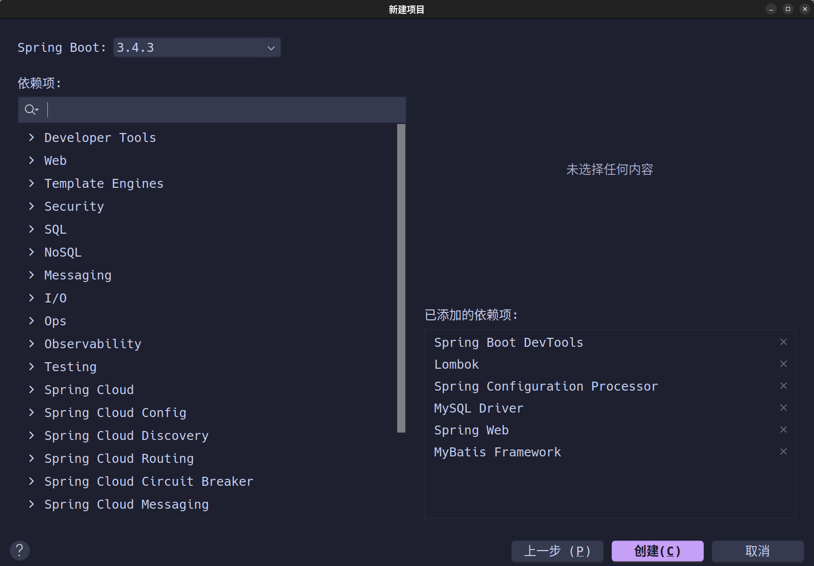
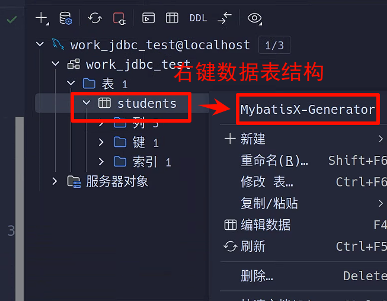
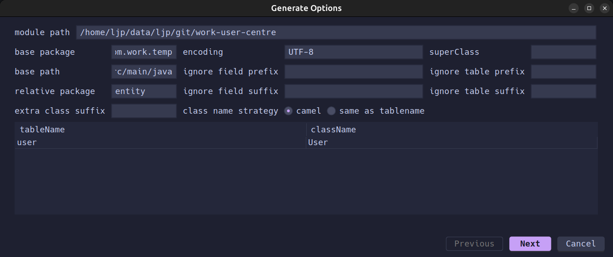
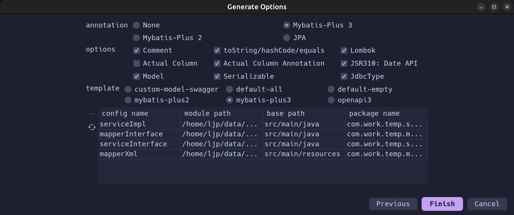

# work-init-model-backend

## 1.项目初始



## 2.项目依赖

```shell
# !/bin/bash
# 脚本文件(必须在 "./" 下执行, "./" 指整个后端端项目的根目录)
mv ./src/main/resources/application.properties ./src/main/resources/application.yaml # yaml 格式更加直观
rm ./src/main/resources/static && rm ./src/main/resources/templates # 这两个文件是为前后端不分离项目准备的
```

```xml
<?xml version="1.0" encoding="UTF-8"?> <!-- pom.xml: 依赖文件(无需改动) -->
<project xmlns="http://maven.apache.org/POM/4.0.0" xmlns:xsi="http://www.w3.org/2001/XMLSchema-instance"
         xsi:schemaLocation="http://maven.apache.org/POM/4.0.0 https://maven.apache.org/xsd/maven-4.0.0.xsd">
    <modelVersion>4.0.0</modelVersion>
    <parent>
        <groupId>org.springframework.boot</groupId>
        <artifactId>spring-boot-starter-parent</artifactId>
        <version>3.4.3</version>
        <relativePath/> <!-- lookup parent from repository -->
    </parent>
    <groupId>com.work</groupId>
    <artifactId>work-user-centre</artifactId>
    <version>0.0.1</version>
    <name>work-user-centre</name>
    <description>work-user-centre</description>
    <url/>
    <licenses>
        <license/>
    </licenses>
    <developers>
        <developer/>
    </developers>
    <scm>
        <connection/>
        <developerConnection/>
        <tag/>
        <url/>
    </scm>
    <properties>
        <java.version>17</java.version>
    </properties>
    <dependencies>

        <!-- Spring -->
        <dependency>
            <groupId>org.springframework.boot</groupId>
            <artifactId>spring-boot-starter-web</artifactId>
        </dependency>
        <dependency>
            <groupId>org.springframework.boot</groupId>
            <artifactId>spring-boot-devtools</artifactId>
            <scope>runtime</scope>
            <optional>true</optional>
        </dependency>
        <dependency>
            <groupId>org.springframework.boot</groupId>
            <artifactId>spring-boot-configuration-processor</artifactId>
            <optional>true</optional>
        </dependency>
        <dependency>
            <groupId>org.springframework.boot</groupId>
            <artifactId>spring-boot-starter-test</artifactId>
            <scope>test</scope>
        </dependency>
        <dependency>
            <groupId>org.mybatis.spring.boot</groupId>
            <artifactId>mybatis-spring-boot-starter-test</artifactId>
            <version>3.0.4</version>
            <scope>test</scope>
        </dependency>

        <!-- Lombok -->
        <dependency>
            <groupId>org.projectlombok</groupId>
            <artifactId>lombok</artifactId>
            <optional>true</optional>
        </dependency>

        <!-- MyBatis -->
        <dependency>
            <groupId>com.mysql</groupId>
            <artifactId>mysql-connector-j</artifactId>
            <scope>runtime</scope>
        </dependency>
        <dependency>
            <groupId>org.mybatis.spring.boot</groupId>
            <artifactId>mybatis-spring-boot-starter</artifactId>
            <version>3.0.4</version>
        </dependency>

    </dependencies>

    <build>
        <plugins>
            <plugin>
                <groupId>org.apache.maven.plugins</groupId>
                <artifactId>maven-compiler-plugin</artifactId>
                <configuration>
                    <annotationProcessorPaths>
                        <path>
                            <groupId>org.springframework.boot</groupId>
                            <artifactId>spring-boot-configuration-processor</artifactId>
                        </path>
                        <path>
                            <groupId>org.projectlombok</groupId>
                            <artifactId>lombok</artifactId>
                        </path>
                    </annotationProcessorPaths>
                </configuration>
            </plugin>
            <plugin>
                <groupId>org.springframework.boot</groupId>
                <artifactId>spring-boot-maven-plugin</artifactId>
                <configuration>
                    <excludes>
                        <exclude>
                            <groupId>org.projectlombok</groupId>
                            <artifactId>lombok</artifactId>
                        </exclude>
                    </excludes>
                </configuration>
            </plugin>
        </plugins>
    </build>

</project>

```

```yaml
# ./src/main/resources/application.yaml: 配置文件
spring:
  application:
    name: work-user-centre

  datasource:
    driver-class-name: com.mysql.cj.jdbc.Driver # "com.mysql.jdbc.Driver" 已经过时
    url: jdbc:mysql://localhost:3306/work_user_centre
    username: work_uc
    password: 123456

server:
  port: 8000

```

```java
// ./src/main/java/com/work/workusercentre/WorkUserCentreApplication.java: 启动文件(无需改动)
package com.work.workusercentre;

import org.springframework.boot.SpringApplication;
import org.springframework.boot.autoconfigure.SpringBootApplication;

@SpringBootApplication
public class WorkUserCentreApplication {
    public static void main(String[] args) {
        /* var context = */ SpringApplication.run(WorkUserCentreApplication.class, args);
    }
}

```

```shell
# ./src/main/resources/banner.txt
██╗    ██╗ ██████╗ ██████╗ ██╗  ██╗    ██╗   ██╗███████╗███████╗██████╗      ██████╗███████╗███╗   ██╗████████╗██████╗ ███████╗██╗
██║    ██║██╔═══██╗██╔══██╗██║ ██╔╝    ██║   ██║██╔════╝██╔════╝██╔══██╗    ██╔════╝██╔════╝████╗  ██║╚══██╔══╝██╔══██╗██╔════╝██║
██║ █╗ ██║██║   ██║██████╔╝█████╔╝     ██║   ██║███████╗█████╗  ██████╔╝    ██║     █████╗  ██╔██╗ ██║   ██║   ██████╔╝█████╗  ██║
██║███╗██║██║   ██║██╔══██╗██╔═██╗     ██║   ██║╚════██║██╔══╝  ██╔══██╗    ██║     ██╔══╝  ██║╚██╗██║   ██║   ██╔══██╗██╔══╝  ╚═╝
╚███╔███╔╝╚██████╔╝██║  ██║██║  ██╗    ╚██████╔╝███████║███████╗██║  ██║    ╚██████╗███████╗██║ ╚████║   ██║   ██║  ██║███████╗██╗
 ╚══╝╚══╝  ╚═════╝ ╚═╝  ╚═╝╚═╝  ╚═╝     ╚═════╝ ╚══════╝╚══════╝╚═╝  ╚═╝     ╚═════╝╚══════╝╚═╝  ╚═══╝   ╚═╝   ╚═╝  ╚═╝╚══════╝╚═╝

The above icon is from the "ANSI Shadow" style at https://patorjk.com/software/taag.

```

## 3.项目说明

> [!CAUTION]
>
> 警告：直接存放在 ./ 下的单文件基本都是配置文件或文档文件，下面的每一个文件中的首行注释都去掉。注意，放在根目录下的目的仅仅是为了不让项目具有过多的目录导致产生杂乱的工作目录树。

```shell
# !/bin/bash
# 脚本文件(必须在 "./" 下执行, "./" 指整个后端端项目的根目录)
touch ./.gitignore && touch ./README.md

```

```shell
# ./.gitignore: 忽略文件
$  vim ./.gitignore && cat ./.gitignore
# 忽略文件路径

```

```shell
# ./README.md: 配置 md
$ vim ./README.md && cat ./README.md
# 项目介绍文件

```

## 4.项目搭建

### 4.1.数据服务模块

> [!CAUTION]
>
> 警告：由于不同的实体不一样，因此下面的文件几乎都需要修改，需要根据您的项目替换 `<...>`。

#### 4.1.1.脚本

```sql
# !/bin/bash
# 脚本文件(必须在 "./" 下执行, "./" 指整个后端端项目的根目录)
mkdir -p ./sql && touch ./sql/init_structure.sql && touch ./sql/init_assumption_data.sql && touch ./sql/init_actual_data.sql
mkdir -p ./src/main/resources/mapper/

```

#### 4.1.2.配置

```xml
<?xml version="1.0" encoding="UTF-8"?> <!-- pom.xml: 依赖文件 -->
<project xmlns="http://maven.apache.org/POM/4.0.0" xmlns:xsi="http://www.w3.org/2001/XMLSchema-instance"
         xsi:schemaLocation="http://maven.apache.org/POM/4.0.0 https://maven.apache.org/xsd/maven-4.0.0.xsd">
    <modelVersion>4.0.0</modelVersion>
    <parent>
        <groupId>org.springframework.boot</groupId>
        <artifactId>spring-boot-starter-parent</artifactId>
        <version>3.4.3</version>
        <relativePath/> <!-- lookup parent from repository -->
    </parent>
    <groupId>com.work</groupId>
    <artifactId>work-user-centre</artifactId>
    <version>0.0.1</version>
    <name>work-user-centre</name>
    <description>work-user-centre</description>
    <url/>
    <licenses>
        <license/>
    </licenses>
    <developers>
        <developer/>
    </developers>
    <scm>
        <connection/>
        <developerConnection/>
        <tag/>
        <url/>
    </scm>
    <properties>
        <java.version>17</java.version>
    </properties>
    <dependencies>

        <!-- Spring -->
        <dependency>
            <groupId>org.springframework.boot</groupId>
            <artifactId>spring-boot-starter-web</artifactId>
        </dependency>
        <dependency>
            <groupId>org.springframework.boot</groupId>
            <artifactId>spring-boot-devtools</artifactId>
            <scope>runtime</scope>
            <optional>true</optional>
        </dependency>
        <dependency>
            <groupId>org.springframework.boot</groupId>
            <artifactId>spring-boot-configuration-processor</artifactId>
            <optional>true</optional>
        </dependency>
        <dependency>
            <groupId>org.springframework.boot</groupId>
            <artifactId>spring-boot-starter-test</artifactId>
            <scope>test</scope>
        </dependency>
        <dependency>
            <groupId>org.mybatis.spring.boot</groupId>
            <artifactId>mybatis-spring-boot-starter-test</artifactId>
            <version>3.0.4</version>
            <scope>test</scope>
        </dependency>

        <!-- Lombok -->
        <dependency>
            <groupId>org.projectlombok</groupId>
            <artifactId>lombok</artifactId>
            <optional>true</optional>
        </dependency>

        <!-- MyBatis -->
        <dependency>
            <groupId>com.mysql</groupId>
            <artifactId>mysql-connector-j</artifactId>
            <scope>runtime</scope>
        </dependency>
        <dependency>
            <groupId>org.mybatis.spring.boot</groupId>
            <artifactId>mybatis-spring-boot-starter</artifactId>
            <version>3.0.4</version>
        </dependency>
        <dependency>
            <groupId>com.baomidou</groupId>
            <artifactId>mybatis-plus-spring-boot3-starter</artifactId>
            <version>3.5.10.1</version>
        </dependency>
        
        <!-- Commons Lang3-->
        <dependency>
            <groupId>org.apache.commons</groupId>
            <artifactId>commons-lang3</artifactId>
            <version>3.12.0</version>
        </dependency>

    </dependencies>

    <build>
        <plugins>
            <plugin>
                <groupId>org.apache.maven.plugins</groupId>
                <artifactId>maven-compiler-plugin</artifactId>
                <configuration>
                    <annotationProcessorPaths>
                        <path>
                            <groupId>org.springframework.boot</groupId>
                            <artifactId>spring-boot-configuration-processor</artifactId>
                        </path>
                        <path>
                            <groupId>org.projectlombok</groupId>
                            <artifactId>lombok</artifactId>
                        </path>
                    </annotationProcessorPaths>
                </configuration>
            </plugin>
            <plugin>
                <groupId>org.springframework.boot</groupId>
                <artifactId>spring-boot-maven-plugin</artifactId>
                <configuration>
                    <excludes>
                        <exclude>
                            <groupId>org.projectlombok</groupId>
                            <artifactId>lombok</artifactId>
                        </exclude>
                    </excludes>
                </configuration>
            </plugin>
        </plugins>
    </build>

</project>

```

```sql
-- ./sql/init_structure.sql: 数据源整体结构
-- 项目数库
DROP DATABASE IF EXISTS work_user_centre;
CREATE DATABASE work_user_centre COLLATE = utf8mb4_unicode_ci;
USE work_user_centre;

-- 项目用户
DROP USER IF EXISTS 'work_uc'@'%';
CREATE USER 'work_uc'@'%' IDENTIFIED BY '123456';
GRANT ALL PRIVILEGES ON work_user_centre.* TO 'work_uc'@'%';
FLUSH PRIVILEGES;

-- 项目数表
CREATE TABLE user (
      id              BIGINT UNSIGNED    AUTO_INCREMENT                                        COMMENT '本用户唯一标识(业务层需要考虑使用雪花算法用户标识的唯一性)',
      user_account    VARCHAR(256)       NULL                                                  COMMENT '账户号(业务层需要决定某一种或多种登录方式, 因此这里不限死为非空)', -- 采用下划线风格, 采用表名前缀标识业务中的重要字段避免关键字冲突问题
      user_wx_union   VARCHAR(256)       NULL                                                  COMMENT '微信号',
      user_mp_open    VARCHAR(256)       NULL                                                  COMMENT '公众号',
      user_email      VARCHAR(256)       NULL                                                  COMMENT '邮箱号',
      user_phone      VARCHAR(20)        NULL                                                  COMMENT '电话号',
      user_ident      VARCHAR(50)        NULL                                                  COMMENT '身份证',
      user_passwd     VARCHAR(512)       NOT NULL                                              COMMENT '用户密码(业务层强制刚刚注册的用户重新设置密码, 交给用户时默认密码为 1234567890, 并且加盐密码)',
      user_avatar     VARCHAR(1024)      NULL                                                  COMMENT '用户头像(业务层需要考虑默认头像使用 cos 对象存储)',
      user_tags       VARCHAR(1024)      NULL                                                  COMMENT '用户标签(业务层需要 json 数组格式存储用户标签数组)',
      user_nick       VARCHAR(256)       NULL                                                  COMMENT '用户昵称',
      user_name       VARCHAR(256)       NULL                                                  COMMENT '用户名字',
      user_profile    VARCHAR(512)       NULL                                                  COMMENT '用户简介',
      user_birthday   VARCHAR(512)       NULL                                                  COMMENT '用户生日',
      user_country    VARCHAR(50)        NULL                                                  COMMENT '用户国家',
      user_address    TEXT               NULL                                                  COMMENT '用户地址',
      user_role       TINYINT            DEFAULT 0                                             COMMENT '用户角色(业务层需知 0 为用户, 1 为管理, 2 为封号, ...)',
      user_level      TINYINT            DEFAULT 0                                             COMMENT '用户等级(业务层需知 0 为普通, 1 为高级, 2 为特权, 3 为企业, ...)',
      user_gender     TINYINT            DEFAULT 0                                             COMMENT '用户性别(业务层需知 0 为未知, 1 为男性, 2 为女性)',
      deleted         TINYINT            DEFAULT 0                                             COMMENT '是否删除(0 为未删除, 1 为已删除)',
      create_time     TIMESTAMP          DEFAULT CURRENT_TIMESTAMP                             COMMENT '创建时间(受时区影响)',
      update_time     TIMESTAMP          DEFAULT CURRENT_TIMESTAMP ON UPDATE CURRENT_TIMESTAMP COMMENT '更新时间(受时区影响)',
      PRIMARY KEY (id), -- 主键
      INDEX idx_email (user_email), -- 根据数据是否具备区分度来建立索引
      INDEX idx_user_nick (user_nick)
) COLLATE = utf8mb4_unicode_ci                                                                 COMMENT '用户信息表';
```

```sql
-- ./sql/init_assumption_data.sql: 数据源模拟数据
-- 模拟数据
TRUNCATE TABLE user;
INSERT INTO user (user_account, user_wx_union, user_mp_open, user_email, user_phone, user_ident, user_passwd, user_avatar, user_tags, user_nick, user_name, user_profile, user_birthday, user_country, user_address, user_role, user_level, user_gender, deleted)
VALUES
    ('aimou', 'wx_union_aimou', 'mp_open_aimou', 'aimou@example.com', '13800138001', '370101198701012345', '47ec2dd791e31e2ef2076caf64ed9b3d', 'https://example.com/avatar_aimou1.jpg', '["tag1"]', 'aimou', '艾梦', '这是艾梦的个人简介', '1987-01-01', '中国', '北京市朝阳区', 0, 1, 1, 0),
    ('bimou', 'wx_union_bimou', 'mp_open_bimou', 'bimou@example.com', '13800138002', '370101198802022345', '47ec2dd791e31e2ef2076caf64ed9b3d', 'https://example.com/avatar_bimou2.jpg', '["tag2"]', 'bimou', '白萌', '这是白萌的个人简介', '1988-02-02', '中国', '上海市浦东新区', 0, 2, 2, 0),
    ('cimou', 'wx_union_cimou', 'mp_open_cimou', 'cimou@example.com', '13800138003', '370101198903032345', '47ec2dd791e31e2ef2076caf64ed9b3d', 'https://example.com/avatar_cimou3.jpg', '["tag3"]', 'cimou', '陈明', '这是陈明的个人简介', '1989-03-03', '中国', '广州市天河区', 0, 1, 1, 0),
    ('dimou', 'wx_union_dimou', 'mp_open_dimou', 'dimou@example.com', '13800138004', '370101199004042345', '47ec2dd791e31e2ef2076caf64ed9b3d', 'https://example.com/avatar_dimou4.jpg', '["tag4"]', 'dimou', '邓梅', '这是邓梅的个人简介', '1990-04-04', '中国', '深圳市福田区', 0, 1, 2, 0),
    ('eimou', 'wx_union_eimou', 'mp_open_eimou', 'eimou@example.com', '13800138005', '370101199105052345', '47ec2dd791e31e2ef2076caf64ed9b3d', 'https://example.com/avatar_eimou5.jpg', '["tag5"]', 'eimou', '易萌', '这是易萌的个人简介', '1991-05-05', '中国', '天津市和平区', 0, 2, 1, 0),
    ('fimou', 'wx_union_fimou', 'mp_open_fimou', 'fimou@example.com', '13800138006', '370101199206062345', '47ec2dd791e31e2ef2076caf64ed9b3d', 'https://example.com/avatar_fimou6.jpg', '["tag6"]', 'fimou', '范敏', '这是范敏的个人简介', '1992-06-06', '中国', '北京市海淀区', 0, 1, 2, 0),
    ('gimou', 'wx_union_gimou', 'mp_open_gimou', 'gimou@example.com', '13800138007', '370101199307072345', '47ec2dd791e31e2ef2076caf64ed9b3d', 'https://example.com/avatar_gimou7.jpg', '["tag7"]', 'gimou', '高梅', '这是高梅的个人简介', '1993-07-07', '中国', '上海市黄浦区', 0, 1, 1, 0),
    ('himou', 'wx_union_himou', 'mp_open_himou', 'himou@example.com', '13800138008', '370101199408082345', '47ec2dd791e31e2ef2076caf64ed9b3d', 'https://example.com/avatar_himou8.jpg', '["tag8"]', 'himou', '黄敏', '这是黄敏的个人简介', '1994-08-08', '中国', '广州市越秀区', 0, 2, 2, 0),
    ('iimou', 'wx_union_iimou', 'mp_open_iimou', 'iimou@example.com', '13800138009', '370101199509092345', '47ec2dd791e31e2ef2076caf64ed9b3d', 'https://example.com/avatar_iimou9.jpg', '["tag9"]', 'iimou', '冯萌', '这是冯萌的个人简介', '1995-09-09', '中国', '深圳市南山区', 0, 1, 1, 0),
    ('jimou', 'wx_union_jimou', 'mp_open_jimou', 'jimou@example.com', '13800138010', '370101199610102345', '47ec2dd791e31e2ef2076caf64ed9b3d', 'https://example.com/avatar_jimou10.jpg', '["tag10"]', 'jimou', '贾梅', '这是贾梅的个人简介', '1996-10-10', '中国', '天津市南开区', 0, 2, 2, 0),
    ('kimou', 'wx_union_kimou', 'mp_open_kimou', 'kimou@example.com', '13800138011', '370101199711112345', '47ec2dd791e31e2ef2076caf64ed9b3d', 'https://example.com/avatar_kimou11.jpg', '["tag11"]', 'kimou', '康铭', '这是康铭的个人简介', '1997-11-11', '中国', '上海市静安区', 0, 1, 1, 0),
    ('limou', 'wx_union_limou', 'mp_open_limou', 'limou@example.com', '13800138012', '370101199812122345', '47ec2dd791e31e2ef2076caf64ed9b3d', 'https://avatars.githubusercontent.com/u/113878415?s=400&u=9f10b63e033c9504615bc475581441478424e04b&v=4', '["项目架构师, 后端程序员, 数学爱好者, 运维发烧者"]', 'limou', '李陌', '这是李萌的个人简介', '2004-02-23', '中国', '广州市白云区', 1, 1, 1, 0),
    ('mimou', 'wx_union_mimou', 'mp_open_mimou', 'mimou@example.com', '13800138016', '370101200204162345', '47ec2dd791e31e2ef2076caf64ed9b3d', 'https://example.com/avatar_mimou16.jpg', '["tag16"]', 'mimou', '莫敏', '这是莫敏的个人简介', '2002-04-16', '中国', '北京市西城区', 0, 1, 1, 0),
    ('nimou', 'wx_union_nimou', 'mp_open_nimou', 'nimou@example.com', '13800138017', '370101200305172345', '47ec2dd791e31e2ef2076caf64ed9b3d', 'https://example.com/avatar_nimou17.jpg', '["tag17"]', 'nimou', '牛梅', '这是牛梅的个人简介', '2003-05-17', '中国', '上海市徐汇区', 0, 1, 2, 0),
    ('oimou', 'wx_union_oimou', 'mp_open_oimou', 'oimou@example.com', '13800138018', '370101200406182345', '47ec2dd791e31e2ef2076caf64ed9b3d', 'https://example.com/avatar_oimou18.jpg', '["tag18"]', 'oimou', '欧阳敏', '这是欧阳敏的个人简介', '2004-06-18', '中国', '深圳市龙华区',0, 2, 1, 0),
    ('pimou', 'wx_union_pimou', 'mp_open_pimou', 'pimou@example.com', '13800138019', '370101200507192345', '47ec2dd791e31e2ef2076caf64ed9b3d', 'https://example.com/avatar_pimou19.jpg', '["tag19"]', 'pimou', '潘萌', '这是潘萌的个人简介', '2005-07-19', '中国', '广州市花都区', 0, 1, 1, 0),
    ('qimou', 'wx_union_qimou', 'mp_open_qimou', 'qimou@example.com', '13800138020', '370101200608202345', '47ec2dd791e31e2ef2076caf64ed9b3d', 'https://example.com/avatar_qimou20.jpg', '["tag20"]', 'qimou', '曲敏', '这是曲敏的个人简介', '2006-08-20', '中国', '上海市杨浦区', 0, 2, 2, 0),
    ('rimou', 'wx_union_rimou', 'mp_open_rimou', 'rimou@example.com', '13800138021', '370101200709212345', '47ec2dd791e31e2ef2076caf64ed9b3d', 'https://example.com/avatar_rimou21.jpg', '["tag21"]', 'rimou', '任梅', '这是任梅的个人简介', '2007-09-21', '中国', '天津市武清区', 0, 1, 1, 0),
    ('simou', 'wx_union_simou', 'mp_open_simou', 'simou@example.com', '13800138022', '370101200810222345', '47ec2dd791e31e2ef2076caf64ed9b3d', 'https://example.com/avatar_simou22.jpg', '["tag22"]', 'simou', '孙萌', '这是孙萌的个人简介', '2008-10-22', '中国', '北京市昌平区', 0, 1, 2, 0),
    ('timou', 'wx_union_timou', 'mp_open_timou', 'timou@example.com', '13800138023', '370101200911232345', '47ec2dd791e31e2ef2076caf64ed9b3d', 'https://example.com/avatar_timou23.jpg', '["tag23"]', 'timou', '陶敏', '这是陶敏的个人简介', '2009-11-23', '中国', '上海市宝山区', 0, 1, 1, 0),
    ('uimou', 'wx_union_uimou', 'mp_open_uimou', 'uimou@example.com', '13800138024', '370101201012242345', '47ec2dd791e31e2ef2076caf64ed9b3d', 'https://example.com/avatar_uimou24.jpg', '["tag24"]', 'uimou', '吴梅', '这是吴梅的个人简介', '2010-12-24', '中国', '深圳市龙岗区', 0, 2, 2, 0),
    ('vimou', 'wx_union_vimou', 'mp_open_vimou', 'vimou@example.com', '13800138025', '370101201112252345', '47ec2dd791e31e2ef2076caf64ed9b3d', 'https://example.com/avatar_vimou25.jpg', '["tag25"]', 'vimou', '韦敏', '这是韦敏的个人简介', '2011-12-25', '中国', '广州市荔湾区', 0, 2, 1, 0),
    ('wimou', 'wx_union_wimou', 'mp_open_wimou', 'wimou@example.com', '13800138026', '370101201212262345', '47ec2dd791e31e2ef2076caf64ed9b3d', 'https://example.com/avatar_wimou26.jpg', '["tag26"]', 'wimou', '魏萌', '这是魏萌的个人简介', '2012-12-26', '中国', '上海市虹口区', 0, 1, 1, 0),
    ('ximou', 'wx_union_ximou', 'mp_open_ximou', 'ximou@example.com', '13800138027', '370101201312272345', '47ec2dd791e31e2ef2076caf64ed9b3d', 'https://example.com/avatar_ximou27.jpg', '["tag27"]', 'ximou', '谢敏', '这是谢敏的个人简介', '2013-12-27', '中国', '深圳市南山区', 0, 1, 2, 0),
    ('yimou', 'wx_union_yimou', 'mp_open_yimou', 'yimou@example.com', '13800138028', '370101201412282345', '47ec2dd791e31e2ef2076caf64ed9b3d', 'https://example.com/avatar_yimou28.jpg', '["tag28"]', 'yimou', '杨萌', '这是杨萌的个人简介', '2014-12-28', '中国', '北京市朝阳区', 0, 1, 1, 0),
    ('zimou', 'wx_union_zimou', 'mp_open_zimou', 'zimou@example.com', '13800138029', '370101201512292345', '47ec2dd791e31e2ef2076caf64ed9b3d', 'https://example.com/avatar_zimou29.jpg', '["tag29"]', 'zimou', '张敏', '这是张敏的个人简介', '2015-12-29', '中国', '上海市浦东新区', 0, 2, 2, 0)
;

```

```sql
-- ./sql/init_actual_data.sql: 数据源真实数据
```

```yaml
# ./src/main/resources/application.yaml: 配置文件
spring:
  application:
    name: work-user-centre

  datasource:
    driver-class-name: com.mysql.cj.jdbc.Driver # "com.mysql.jdbc.Driver" 已经过时
    url: jdbc:mysql://localhost:3306/work_user_centre
    username: work_uc
    password: 123456

server:
  port: 8000

mybatis-plus:
  global-config:
    db-config:
      logic-delete-field: deleted # 指定数据库全局逻辑删除字段名, 并且给实体类的对应字段加上 @TableLogic
      logic-delete-value: 1 # 逻辑已删除值
      logic-not-delete-value: 0 # 逻辑未删除值

```

可以使用 `MyBatisX` 插件快速替换生成实体类、映射类、服务类的过程，并且我们也推荐这么做。







然后把 `temp` 软件包下的三个包覆盖到项目基本包下，以及把生成的 `.xml` 文件放在 `./src/main/resources/mapper/` 下（利用 `IDEA` 的重构进行迁移），注意不要直接生成到核心代码中以避免出错。需要注意的是，在实体类中默认给的 `@TableId(value = "id", type = IdType.AUTO)` 不支持分库分表，如果需要使用雪花算法则可以使用 `@TableId(type = IdType.ASSIGN_ID)`。并且 `MyBatisPlus` 又多出一层 `Service` 接口和类的封装就是因为 `Mapper` 提供的接口是很粗暴的，但是有些验证逻辑又需要我们来把控，而且还有一些基于 `CRUD` 的复合接口，因此多出的服务层就是为了让用户自己把控业务接口的编写（只做）。

```java
// ./src/main/java/com/work/workusercentre/entity/User.java: 实体类
package com.work.workusercentre.entity;

import com.baomidou.mybatisplus.annotation.*;

import java.io.Serial;
import java.io.Serializable;
import java.time.LocalDateTime;
import lombok.Data;

/**
 * 用户信息表
 * @TableName user
 */
@TableName(value ="user")
@Data
public class User implements Serializable {
    /**
     * 本用户唯一标识(业务层需要考虑使用雪花算法用户标识的唯一性)
     */
    @TableId(value = "id", type = IdType.ASSIGN_ID)
    private Long id;

    /**
     * 账户号(业务层需要决定某一种或多种登录方式, 因此这里不限死为非空)
     */
    @TableField(value = "user_account")
    private String userAccount;

    /**
     * 微信号
     */
    @TableField(value = "user_wx_union")
    private String userWxUnion;

    /**
     * 公众号
     */
    @TableField(value = "user_mp_open")
    private String userMpOpen;

    /**
     * 邮箱号
     */
    @TableField(value = "user_email")
    private String userEmail;

    /**
     * 电话号
     */
    @TableField(value = "user_phone")
    private String userPhone;

    /**
     * 身份证
     */
    @TableField(value = "user_ident")
    private String userIdent;

    /**
     * 用户密码(业务层强制刚刚注册的用户重新设置密码, 交给用户时默认密码为 1234567890, 并且加盐密码)
     */
    @TableField(value = "user_passwd")
    private String userPasswd;

    /**
     * 用户头像(业务层需要考虑默认头像使用 cos 对象存储)
     */
    @TableField(value = "user_avatar")
    private String userAvatar;

    /**
     * 用户标签(业务层需要 json 数组格式存储用户标签数组)
     */
    @TableField(value = "user_tags")
    private String userTags;

    /**
     * 用户昵称
     */
    @TableField(value = "user_nick")
    private String userNick;

    /**
     * 用户名字
     */
    @TableField(value = "user_name")
    private String userName;

    /**
     * 用户简介
     */
    @TableField(value = "user_profile")
    private String userProfile;

    /**
     * 用户生日
     */
    @TableField(value = "user_birthday")
    private String userBirthday;

    /**
     * 用户国家
     */
    @TableField(value = "user_country")
    private String userCountry;

    /**
     * 用户地址
     */
    @TableField(value = "user_address")
    private String userAddress;

    /**
     * 用户角色(业务层需知 0 为用户, 1 为管理, 2 为封号, ...)
     */
    @TableField(value = "user_role")
    private Integer userRole;

    /**
     * 用户等级(业务层需知 0 为普通, 1 为高级, 2 为特权, 3 为企业, ...)
     */
    @TableField(value = "user_level")
    private Integer userLevel;

    /**
     * 用户性别(业务层需知 0 为未知, 1 为男性, 2 为女性)
     */
    @TableField(value = "user_gender")
    private Integer userGender;

    /**
     * 是否删除(0 为未删除, 1 为已删除)
     */
    @TableLogic
    @TableField(value = "deleted")
    private Integer deleted;

    /**
     * 创建时间(受时区影响)
     */
    @TableField(value = "create_time")
    private LocalDateTime createTime;

    /**
     * 更新时间(受时区影响)
     */
    @TableField(value = "update_time")
    private LocalDateTime updateTime;

    @Serial
    @TableField(exist = false)
    private static final long serialVersionUID = 1L;

    @Override
    public boolean equals(Object that) {
        if (this == that) {
            return true;
        }
        if (that == null) {
            return false;
        }
        if (getClass() != that.getClass()) {
            return false;
        }
        User other = (User) that;
        return (this.getId() == null ? other.getId() == null : this.getId().equals(other.getId()))
            && (this.getUserAccount() == null ? other.getUserAccount() == null : this.getUserAccount().equals(other.getUserAccount()))
            && (this.getUserWxUnion() == null ? other.getUserWxUnion() == null : this.getUserWxUnion().equals(other.getUserWxUnion()))
            && (this.getUserMpOpen() == null ? other.getUserMpOpen() == null : this.getUserMpOpen().equals(other.getUserMpOpen()))
            && (this.getUserEmail() == null ? other.getUserEmail() == null : this.getUserEmail().equals(other.getUserEmail()))
            && (this.getUserPhone() == null ? other.getUserPhone() == null : this.getUserPhone().equals(other.getUserPhone()))
            && (this.getUserIdent() == null ? other.getUserIdent() == null : this.getUserIdent().equals(other.getUserIdent()))
            && (this.getUserPasswd() == null ? other.getUserPasswd() == null : this.getUserPasswd().equals(other.getUserPasswd()))
            && (this.getUserAvatar() == null ? other.getUserAvatar() == null : this.getUserAvatar().equals(other.getUserAvatar()))
            && (this.getUserTags() == null ? other.getUserTags() == null : this.getUserTags().equals(other.getUserTags()))
            && (this.getUserNick() == null ? other.getUserNick() == null : this.getUserNick().equals(other.getUserNick()))
            && (this.getUserName() == null ? other.getUserName() == null : this.getUserName().equals(other.getUserName()))
            && (this.getUserProfile() == null ? other.getUserProfile() == null : this.getUserProfile().equals(other.getUserProfile()))
            && (this.getUserBirthday() == null ? other.getUserBirthday() == null : this.getUserBirthday().equals(other.getUserBirthday()))
            && (this.getUserCountry() == null ? other.getUserCountry() == null : this.getUserCountry().equals(other.getUserCountry()))
            && (this.getUserAddress() == null ? other.getUserAddress() == null : this.getUserAddress().equals(other.getUserAddress()))
            && (this.getUserRole() == null ? other.getUserRole() == null : this.getUserRole().equals(other.getUserRole()))
            && (this.getUserLevel() == null ? other.getUserLevel() == null : this.getUserLevel().equals(other.getUserLevel()))
            && (this.getUserGender() == null ? other.getUserGender() == null : this.getUserGender().equals(other.getUserGender()))
            && (this.getDeleted() == null ? other.getDeleted() == null : this.getDeleted().equals(other.getDeleted()))
            && (this.getCreateTime() == null ? other.getCreateTime() == null : this.getCreateTime().equals(other.getCreateTime()))
            && (this.getUpdateTime() == null ? other.getUpdateTime() == null : this.getUpdateTime().equals(other.getUpdateTime()));
    }

    @Override
    public int hashCode() {
        final int prime = 31;
        int result = 1;
        result = prime * result + ((getId() == null) ? 0 : getId().hashCode());
        result = prime * result + ((getUserAccount() == null) ? 0 : getUserAccount().hashCode());
        result = prime * result + ((getUserWxUnion() == null) ? 0 : getUserWxUnion().hashCode());
        result = prime * result + ((getUserMpOpen() == null) ? 0 : getUserMpOpen().hashCode());
        result = prime * result + ((getUserEmail() == null) ? 0 : getUserEmail().hashCode());
        result = prime * result + ((getUserPhone() == null) ? 0 : getUserPhone().hashCode());
        result = prime * result + ((getUserIdent() == null) ? 0 : getUserIdent().hashCode());
        result = prime * result + ((getUserPasswd() == null) ? 0 : getUserPasswd().hashCode());
        result = prime * result + ((getUserAvatar() == null) ? 0 : getUserAvatar().hashCode());
        result = prime * result + ((getUserTags() == null) ? 0 : getUserTags().hashCode());
        result = prime * result + ((getUserNick() == null) ? 0 : getUserNick().hashCode());
        result = prime * result + ((getUserName() == null) ? 0 : getUserName().hashCode());
        result = prime * result + ((getUserProfile() == null) ? 0 : getUserProfile().hashCode());
        result = prime * result + ((getUserBirthday() == null) ? 0 : getUserBirthday().hashCode());
        result = prime * result + ((getUserCountry() == null) ? 0 : getUserCountry().hashCode());
        result = prime * result + ((getUserAddress() == null) ? 0 : getUserAddress().hashCode());
        result = prime * result + ((getUserRole() == null) ? 0 : getUserRole().hashCode());
        result = prime * result + ((getUserLevel() == null) ? 0 : getUserLevel().hashCode());
        result = prime * result + ((getUserGender() == null) ? 0 : getUserGender().hashCode());
        result = prime * result + ((getDeleted() == null) ? 0 : getDeleted().hashCode());
        result = prime * result + ((getCreateTime() == null) ? 0 : getCreateTime().hashCode());
        result = prime * result + ((getUpdateTime() == null) ? 0 : getUpdateTime().hashCode());
        return result;
    }

    @Override
    public String toString() {
        StringBuilder sb = new StringBuilder();
        sb.append(getClass().getSimpleName());
        sb.append(" [");
        sb.append("Hash = ").append(hashCode());
        sb.append(", id=").append(id);
        sb.append(", userAccount=").append(userAccount);
        sb.append(", userWxUnion=").append(userWxUnion);
        sb.append(", userMpOpen=").append(userMpOpen);
        sb.append(", userEmail=").append(userEmail);
        sb.append(", userPhone=").append(userPhone);
        sb.append(", userIdent=").append(userIdent);
        sb.append(", userPasswd=").append(userPasswd);
        sb.append(", userAvatar=").append(userAvatar);
        sb.append(", userTags=").append(userTags);
        sb.append(", userNick=").append(userNick);
        sb.append(", userName=").append(userName);
        sb.append(", userProfile=").append(userProfile);
        sb.append(", userBirthday=").append(userBirthday);
        sb.append(", userCountry=").append(userCountry);
        sb.append(", userAddress=").append(userAddress);
        sb.append(", userRole=").append(userRole);
        sb.append(", userLevel=").append(userLevel);
        sb.append(", userGender=").append(userGender);
        sb.append(", deleted=").append(deleted);
        sb.append(", createTime=").append(createTime);
        sb.append(", updateTime=").append(updateTime);
        sb.append(", serialVersionUID=").append(serialVersionUID);
        sb.append("]");
        return sb.toString();
    }
}

```

```java
// ./src/main/java/com/work/workusercentre/mapper/UserMapper.java: 映射类
package com.work.workusercentre.mapper;

import com.work.workusercentre.entity.User;
import com.baomidou.mybatisplus.core.mapper.BaseMapper;

/**
* @author ljp
* @description 针对表【user(用户信息表)】的数据库操作 Mapper
* @createDate 2025-03-06 10:25:51
* @Entity com.work.workusercentre.entity.User
*/
public interface UserMapper extends BaseMapper<User> {

}

```

```xml
<!-- ./src/main/resources/mapper/UserMapper.xml: 映射文件 -->
<?xml version="1.0" encoding="UTF-8"?>
<!DOCTYPE mapper
        PUBLIC "-//mybatis.org//DTD Mapper 3.0//EN"
        "http://mybatis.org/dtd/mybatis-3-mapper.dtd">
<mapper namespace="com.work.workusercentre.mapper.UserMapper">

    <resultMap id="BaseResultMap" type="com.work.workusercentre.entity.User">
            <id property="id" column="id" jdbcType="BIGINT"/>
            <result property="userAccount" column="user_account" jdbcType="VARCHAR"/>
            <result property="userWxUnion" column="user_wx_union" jdbcType="VARCHAR"/>
            <result property="userMpOpen" column="user_mp_open" jdbcType="VARCHAR"/>
            <result property="userEmail" column="user_email" jdbcType="VARCHAR"/>
            <result property="userPhone" column="user_phone" jdbcType="VARCHAR"/>
            <result property="userIdent" column="user_ident" jdbcType="VARCHAR"/>
            <result property="userPasswd" column="user_passwd" jdbcType="VARCHAR"/>
            <result property="userAvatar" column="user_avatar" jdbcType="VARCHAR"/>
            <result property="userTags" column="user_tags" jdbcType="VARCHAR"/>
            <result property="userNick" column="user_nick" jdbcType="VARCHAR"/>
            <result property="userName" column="user_name" jdbcType="VARCHAR"/>
            <result property="userProfile" column="user_profile" jdbcType="VARCHAR"/>
            <result property="userBirthday" column="user_birthday" jdbcType="VARCHAR"/>
            <result property="userCountry" column="user_country" jdbcType="VARCHAR"/>
            <result property="userAddress" column="user_address" jdbcType="VARCHAR"/>
            <result property="userRole" column="user_role" jdbcType="TINYINT"/>
            <result property="userLevel" column="user_level" jdbcType="TINYINT"/>
            <result property="userGender" column="user_gender" jdbcType="TINYINT"/>
            <result property="deleted" column="deleted" jdbcType="TINYINT"/>
            <result property="createTime" column="create_time" jdbcType="TIMESTAMP"/>
            <result property="updateTime" column="update_time" jdbcType="TIMESTAMP"/>
    </resultMap>

    <sql id="Base_Column_List">
        id,user_account,user_wx_union,user_mp_open,user_email,user_phone,
        user_ident,user_passwd,user_avatar,user_tags,user_nick,
        user_name,user_profile,user_birthday,user_country,user_address,
        user_role,user_level,user_gender,deleted,create_time,
        update_time
    </sql>
</mapper>

```

```java
// ./src/main/java/com/work/workusercentre/service/UserService.java: 服务接口
package com.work.workusercentre.service;

import com.baomidou.mybatisplus.extension.service.IService;
import com.work.workusercentre.entity.User;
import jakarta.servlet.http.HttpServletRequest;

/**
 * @author ljp
 * @description 针对表【user(用户信息表)】的数据库操作 Service
 * @createDate 2025-03-06 10:25:51
 */
public interface UserService extends IService<User> {
    /**
     * 用户注册服务
     *
     * @param userAccount
     * @param userPasswd
     * @param checkPasswd
     * @return 用户 id
     */
    long userRegister(String userAccount, String userPasswd, String checkPasswd);

    /**
     * 用户登入服务
     *
     * @param userAccount
     * @param userPasswd
     * @param request
     * @return 脱敏后的用户信息
     */
    User userLogin(String userAccount, String userPasswd, HttpServletRequest request);

    /**
     * 用户登出服务
     *
     * @param request
     * @return 是否登出成功
     */
    boolean userLogout(HttpServletRequest request);
}

```

```java
// ./src/main/java/com/work/workusercentre/service/impl/UserServiceImpl.java: 服务类
package com.work.workusercentre.service.impl;

import com.baomidou.mybatisplus.core.conditions.query.LambdaQueryWrapper;
import com.baomidou.mybatisplus.extension.service.impl.ServiceImpl;
import com.work.workusercentre.entity.User;
import com.work.workusercentre.mapper.UserMapper;
import com.work.workusercentre.service.UserService;
import jakarta.servlet.http.HttpServletRequest;
import lombok.extern.slf4j.Slf4j;
import org.apache.commons.lang3.StringUtils;
import org.springframework.stereotype.Service;
import org.springframework.transaction.annotation.Transactional;
import org.springframework.util.DigestUtils;

import java.nio.charset.StandardCharsets;
import java.time.LocalDateTime;

// TODO: 进行单元测试

/**
 * @author ljp
 * @description 针对表【user(用户信息表)】的数据库操作 Service 实现
 * @createDate 2025-03-06 10:25:51
 */
@Service
@Transactional
@Slf4j
public class UserServiceImpl extends ServiceImpl<UserMapper, User> implements UserService {
    /**
     * 盐值
     */
    private static final String SALT = "test"; // TODO: 这里的盐值需要修改一下, 不能暴露出去

    /**
     * 用户登录状态
     */
    private static final String USER_LOGIN_STA = "user_is_login"; // TODO: 提取为常量

    @Override
    public long userRegister(String userAccount, String userPasswd, String checkPasswd) {
        // 1. 参数校验 // TODO: 参数校验这里可以提取到工具类
        // (1) 判断传入的所有字符串是否都是空白(null、空字符串、仅包含空格）
        if (StringUtils.isAllBlank(userAccount, userPasswd, checkPasswd)) {
            return -1; // TODO: 这里的返回值需要修改为异常
        }

        // (2) 判断账户和密码的长度是否符合要求
        if (userAccount.length() < 4 || userPasswd.length() < 6 || checkPasswd.length() < 6) {
            return -1;
        }

        // (3) 避免账户中的非法字符
        String validPattern = "^[a-zA-Z0-9$_-]+$";
        if (!userPasswd.matches(validPattern)) {
            return -1;
        }

        // (4) 判断两次输入的密码是否一致
        if (!userPasswd.equals(checkPasswd)) {
            return -1;
        }

        // (5) 避免重复注册用户
        LambdaQueryWrapper<User> lambdaQueryWrapper = new LambdaQueryWrapper<>();
        lambdaQueryWrapper.eq(User::getUserAccount, userAccount);
        if (this.count(lambdaQueryWrapper) > 0) {
            return -1;
        }

        // 2. 密码加密
        String newUserPasswd = DigestUtils.md5DigestAsHex((UserServiceImpl.SALT + userPasswd).getBytes(StandardCharsets.UTF_8));

        // 3. 创建用户
        User user = new User();
        user.setUserAccount(userAccount);
        user.setUserPasswd(newUserPasswd);

        // 4. 注册用户
        boolean saveResult = this.save(user);
        if (!saveResult) { // 避免拆箱错误
            return -1;
        }

        return user.getId();
    }

    @Override
    public User userLogin(String userAccount, String userPasswd, HttpServletRequest request) {
        // TODO: 限制流量控制

        // 1. 参数校验
        // (1) 判断传入的所有字符串是否都是空白(null、空字符串、仅包含空格）
        if (StringUtils.isAllBlank(userAccount, userPasswd)) {
            return null; // TODO: 这里的返回值需要修改为异常
        }

        // (2) 判断账户和密码的长度是否符合要求
        if (userAccount.length() < 4 || userPasswd.length() < 6) {
            return null;
        }

        // (3) 避免账户中的非法字符
        String validPattern = "^[a-zA-Z0-9$_-]+$";
        if (!userPasswd.matches(validPattern)) {
            return null;
        }

        // 2. 密码加密
        String newUserPasswd = DigestUtils.md5DigestAsHex((UserServiceImpl.SALT + userPasswd).getBytes(StandardCharsets.UTF_8));

        // 3. 查询用户
        LambdaQueryWrapper<User> lambdaQueryWrapper = new LambdaQueryWrapper<>();
        lambdaQueryWrapper.eq(User::getUserAccount, userAccount).eq(User::getUserPasswd, newUserPasswd); // TODO: 缺少注解
        User user = this.getOne(lambdaQueryWrapper); // TODO: 不太保证该方法的异常
        if (user == null) {
            log.info("用户名或密码错误");
            return null;
        }

        // 4. 脱敏信息
        User safetUser = new User(); // TODO: 可以封装为 Vo 工具类
        safetUser.setId(user.getId());
        safetUser.setUserAccount(user.getUserAccount());
        safetUser.setUserWxUnion(user.getUserWxUnion());
        safetUser.setUserMpOpen(user.getUserMpOpen());
        safetUser.setUserEmail(user.getUserEmail());
        safetUser.setUserPhone(user.getUserPhone());
        safetUser.setUserIdent(user.getUserIdent());
        safetUser.setUserPasswd("");
        safetUser.setUserAvatar(user.getUserAvatar());
        safetUser.setUserTags(user.getUserTags());
        safetUser.setUserNick(user.getUserNick());
        safetUser.setUserName(user.getUserName());
        safetUser.setUserProfile(user.getUserProfile());
        safetUser.setUserBirthday(user.getUserBirthday());
        safetUser.setUserCountry(user.getUserCountry());
        safetUser.setUserAddress(user.getUserAddress());
        safetUser.setUserRole(user.getUserRole());
        safetUser.setUserLevel(user.getUserLevel());
        safetUser.setUserGender(user.getUserGender());
        safetUser.setDeleted(0);
        safetUser.setCreateTime(LocalDateTime.now());
        safetUser.setUpdateTime(LocalDateTime.now());

        // 5. 创建会话
        // TODO: 改为 Redis 分布式存储
        request.getSession().setAttribute(USER_LOGIN_STA, safetUser); // session 数据存储在应用服务器 Tomcat 中, 以后可以通过 request.getSession().getAttribute(USER_LOGIN_STA) 取出用户登陆自己浏览器中本应用的 session 信息 safetUser, 不过类型变成了 Object, 可以后续强转恢复

        return safetUser;
    }

    @Override
    public boolean userLogout(HttpServletRequest request) {
        String USER_LOGIN_STA = "USER_IS_LOGIN"; // TODO: 等待替换为常量

        // TODO: 改为 Redis 分布式存储
        request.getSession().removeAttribute(USER_LOGIN_STA);
        return true;
    }
}

```

在 `UserService` 接口中，不能直接调用 `UserMapper` 的方法而是调用继承而来的 `ServiceImpl<UserMapper, User>` 类中的方法，然后必须实现从 `UserService` 类中定义的方法，这些方法以后会作为控制层的组成部分。而在 `UserService` 类中，常见的可用方法如下（内部则可以使用 `this` 调用，外部则可以注入一个服务 `Bean` 来调用）：

- 增方法
  - `boolean save(T entity);`
  - `boolean saveBatch(Collection<T> entityList);`
  - `boolean saveOrUpdate(T entity);`
  - `boolean saveOrUpdateBatch(Collection<T> entityList);`
- 删方法
  - `boolean removeById(Serializable id);`
  - `boolean removeByMap(Map<String, Object> columnMap);`
  - `boolean remove(Wrapper<T> queryWrapper);`
  - `boolean removeBatchByIds(Collection<? extends Serializable> idList);`
- 改方法
  - `boolean updateById(T entity);`
  - `boolean update(T entity, Wrapper<T> updateWrapper);`
  - `boolean updateBatchById(Collection<T> entityList);`
- 查方法
  - `T getById(Serializable id);`
  - `List<T> listByIds(Collection<? extends Serializable> idList);`
  - `T getOne(Wrapper<T> queryWrapper, throwEx);`
  - `List<T> list(Wrapper<T> queryWrapper);`
  - `long count(Wrapper<T> queryWrapper);`

如果需要编写实体类实例，，可采用插件 `GenerateAllSetter` 来快速创建一个实体类实例。另外为了避免重复编写一些校验逻辑，我还引入了 `Commons Lang3`。

如果需要数据脱敏，可采用 `BeanUtils.copyProperties()` 字段拷贝来达成这个目的，把脱敏前面的类字段拷贝到另外一个类字段中，但是后者类字段只有前者的部分类字段，因此达成脱敏。这么写会有一些性能损失，但是直观，可读性更强，修改更易。

如果需要逻辑删除，可采用 `MyBatisPlus` 的注解 `@TableField(value = "deleted")`，并且在 `application.yaml` 配置中启用逻辑删除功能（上面文件中有注释，可以阅读下 [文档](https://baomidou.com/guides/logic-delete/)）。

如果需要自动填充，可采用 `Auto Filling Java Call Arguments` 插件。

```java
// ./src/main/java/com/work/workusercentre/WorkUserCentreApplication.java: 启动文件
package com.work.workusercentre;

import org.mybatis.spring.annotation.MapperScan;
import org.springframework.boot.SpringApplication;
import org.springframework.boot.autoconfigure.SpringBootApplication;

@SpringBootApplication
@MapperScan("com.work.workusercentre.mapper") // 启用 MyBatisPlus 扫描 ./src/Mapper/ 中的映射
public class WorkUserCentreApplication {
    public static void main(String[] args) {
        /* var context = */ SpringApplication.run(WorkUserCentreApplication.class, args);
    }
}

```

### 4.2.网络请求模块

> [!CAUTION]
>
> 警告：由于不同的实体不一样，因此下面的文件几乎都需要修改，需要根据您的项目替换 `<...>`。

#### 4.1.1.脚本

```sql
# !/bin/bash
# 脚本文件(必须在 "./" 下执行, "./" 指整个后端端项目的根目录)
mkdir -p ./src/main/java/com/work/workusercentre/request/
mkdir -p ./src/main/java/com/work/workusercentre/controller/

```

#### 4.1.2.配置

关联序列化前端 `Http` 请求中的 `body` 为 `json`。

```java
// ./src/main/java/com/work/workusercentre/request/UserRegisterRequest.java
package com.work.workusercentre.request;

import lombok.Data;

import java.io.Serial;
import java.io.Serializable;

@Data
public class UserRegisterRequest implements Serializable {
    @Serial
    private static final long serialVersionUID = 1L;

    private String userAccount;

    private String userPasswd;

    private String checkPasswd;
}

```

```java
// ./src/main/java/com/work/workusercentre/request/UserLoginRequest.java
package com.work.workusercentre.request;

import lombok.Data;

import java.io.Serial;
import java.io.Serializable;

@Data
public class UserLoginRequest implements Serializable {
    @Serial
    private static final long serialVersionUID = 1L;

    private String userAccount;

    private String userPasswd;
}

```

再编写控制层。

```java
// ./src/main/java/com/work/workusercentre/controller/UserController.java
package com.work.workusercentre.controller;

import com.baomidou.mybatisplus.core.conditions.query.LambdaQueryWrapper;
import com.work.workusercentre.entity.User;
import com.work.workusercentre.mapper.UserMapper;
import com.work.workusercentre.request.UserLoginRequest;
import com.work.workusercentre.request.UserRegisterRequest;
import com.work.workusercentre.service.UserService;
import jakarta.annotation.Resource;
import jakarta.servlet.http.HttpServletRequest;
import org.springframework.web.bind.annotation.*;

import java.util.ArrayList;
import java.util.List;

@RestController // 返回值默认为 json 类型
@RequestMapping("/user")
public class UserController {

    @Resource
    private UserMapper userMapper;

    @Resource
    private UserService userService;

    /**
     * 用户注册接口
     *
     * @param userRegisterRequest
     * @return 用户 id
     */
    @PostMapping("/register")
    public Long userRegister(@RequestBody UserRegisterRequest userRegisterRequest) { // @RequestBody 将前端 HTTP 请求的 body 解析成 Java 对象
        // 参数校验
        if (userRegisterRequest == null) { // TODO: 可以在控制层中再次校验, 倾向请求参数本身的简单校验(例如非空)
            return null;
        }

        return userService.userRegister(userRegisterRequest.getUserAccount(), userRegisterRequest.getUserPasswd(), userRegisterRequest.getCheckPasswd());
    }

    /**
     * 用户登入接口
     *
     * @param userLoginRequest
     * @return 脱敏后的用户信息
     */
    @PostMapping("/login")
    public User userLogin(@RequestBody UserLoginRequest userLoginRequest, HttpServletRequest request) {
        // 参数校验
        if (userLoginRequest == null) { // TODO: 可以在控制层中再次校验, 倾向请求参数本身的简单校验(例如非空)
            return null;
        }

        return userService.userLogin(userLoginRequest.getUserAccount(), userLoginRequest.getUserPasswd(), request);
    }

    /**
     * 用户登出接口
     *
     * @return 是否登出成功
     */
    @PostMapping("/logout")
    public boolean userLogout(HttpServletRequest request) {
        return userService.userLogout(request);
    }

    /**
     * 模糊查询搜索用户列表接口
     *
     * @param userName
     * @return 用户列表
     */
    @GetMapping("/search")
    public List<User> searchUsers(@RequestParam String userName, HttpServletRequest request) { // @RequestParam 将前端 HTTP GIT 请求的参数解析成 Java 对象
        // 权限校验 // TODO: 这里的权限需要修改为 AOP
        String USER_LOGIN_STA = "USER_IS_LOGIN"; // 等待替换为常量
        User user = (User)request.getSession().getAttribute(USER_LOGIN_STA);
        if (user == null || user.getUserRole() != 1) { // 1 为管理员权限 // TODO: 这里的权限需要修改为枚举常量
            return new ArrayList<>();
        }

        LambdaQueryWrapper<User> lambdaQueryWrapper = new LambdaQueryWrapper<>();
        if (StringUtils.isNotBlank(userName)) {
            lambdaQueryWrapper.like(User::getUserName, userName);
        }

        List<User> userList = userService.list(lambdaQueryWrapper);
        return userList.stream().map(user -> {
            user.setUserPasswd(null); // TODO: 需要保持和前面的脱敏一致
            return user;
        }).collect(Collectors.toList());
    }

    /**
     * 删除用户接口
     *
     * @param id
     * @return 是否删除成功
     */
    // TODO: 只有管理员权限才可以调用
    @PostMapping("/delete")
    public boolean deleteUser(@RequestBody long id, HttpServletRequest request) {
        // 权限校验 // TODO: 这里的权限需要修改为 AOP
        String USER_LOGIN_STA = "USER_IS_LOGIN"; // 等待替换为常量
        User user = (User)request.getSession().getAttribute(USER_LOGIN_STA);
        if (user == null || user.getUserRole() != 1) { // 1 为管理员权限 // TODO: 这里的权限需要修改为枚举常量
            return false;
        }

        return userService.removeById(id); // 这里 MyBatisPlus 会自动转化为逻辑删除
    }
}

```

### 4.3.常量文件模块

> [!CAUTION]
>
> 警告：

#### 4.4.1.脚本

```sql
# !/bin/bash
# 脚本文件(必须在 "./" 下执行, "./" 指整个后端端项目的根目录)
mkdir -p ./src/constant

```

#### 4.4.2.配置

```java
// ./src/main/java/com/work/workusercentre/contant/UserConstant.java
package com.work.workusercentre.contant;

/**
 * 用户常量
 *
 * @author ljp
 */
public interface UserConstant {
    /**
     * 用户登录状态
     */
    String USER_LOGIN_STA = "user_is_login";

    /**
     * 用户角色
     */
    int USER_ROLE = 0;

    /**
     * 管理角色
     */
    int ADMIN_ROLE = 1;

    /**
     * 封号角色
     */
    int BAN_ROLE = 2;
}

```

```java
// ./src/main/java/com/work/workusercentre/contant/ConfigConstant.java
package com.work.workusercentre.contant;

public interface ConfigConstant {
    /**
     * 盐值
     */
    String SALT = "work-user-centre";
}

```

```java
// ./src/main/java/com/work/workusercentre/service/impl/UserServiceImpl.java
package com.work.workusercentre.service.impl;

import com.baomidou.mybatisplus.core.conditions.query.LambdaQueryWrapper;
import com.baomidou.mybatisplus.extension.service.impl.ServiceImpl;
import com.work.workusercentre.entity.User;
import com.work.workusercentre.mapper.UserMapper;
import com.work.workusercentre.service.UserService;
import jakarta.servlet.http.HttpServletRequest;
import lombok.extern.slf4j.Slf4j;
import org.apache.commons.lang3.StringUtils;
import org.springframework.stereotype.Service;
import org.springframework.transaction.annotation.Transactional;
import org.springframework.util.DigestUtils;

import java.nio.charset.StandardCharsets;
import java.time.LocalDateTime;

import static com.work.workusercentre.contant.ConfigConstant.SALT;
import static com.work.workusercentre.contant.UserConstant.USER_LOGIN_STA;

// TODO: 进行单元测试

/**
 * @author ljp
 * @description 针对表【user(用户信息表)】的数据库操作 Service 实现
 * @createDate 2025-03-06 10:25:51
 */
@Service
@Transactional
@Slf4j
public class UserServiceImpl extends ServiceImpl<UserMapper, User> implements UserService {
    @Override
    public long userRegister(String userAccount, String userPasswd, String checkPasswd) {
        // 1. 参数校验 // TODO: 参数校验这里可以提取到工具类
        // (1) 判断传入的所有字符串是否都是空白(null、空字符串、仅包含空格）
        if (StringUtils.isAllBlank(userAccount, userPasswd, checkPasswd)) {
            return -1; // TODO: 这里的返回值需要修改为异常
        }

        // (2) 判断账户和密码的长度是否符合要求
        if (userAccount.length() < 4 || userPasswd.length() < 6 || checkPasswd.length() < 6) {
            return -1;
        }

        // (3) 避免账户中的非法字符
        String validPattern = "^[a-zA-Z0-9$_-]+$";
        if (!userPasswd.matches(validPattern)) {
            return -1;
        }

        // (4) 判断两次输入的密码是否一致
        if (!userPasswd.equals(checkPasswd)) {
            return -1;
        }

        // (5) 避免重复注册用户
        LambdaQueryWrapper<User> lambdaQueryWrapper = new LambdaQueryWrapper<>();
        lambdaQueryWrapper.eq(User::getUserAccount, userAccount);
        if (this.count(lambdaQueryWrapper) > 0) {
            return -1;
        }

        // 2. 密码加密
        String newUserPasswd = DigestUtils.md5DigestAsHex((SALT + userPasswd).getBytes(StandardCharsets.UTF_8));

        // 3. 创建用户
        User user = new User();
        user.setUserAccount(userAccount);
        user.setUserPasswd(newUserPasswd);

        // 4. 注册用户
        boolean saveResult = this.save(user);
        if (!saveResult) { // 避免拆箱错误
            return -1;
        }

        return user.getId();
    }

    @Override
    public User userLogin(String userAccount, String userPasswd, HttpServletRequest request) {
        // TODO: 限制流量控制

        // 1. 参数校验
        // (1) 判断传入的所有字符串是否都是空白(null、空字符串、仅包含空格）
        if (StringUtils.isAllBlank(userAccount, userPasswd)) {
            return null; // TODO: 这里的返回值需要修改为异常
        }

        // (2) 判断账户和密码的长度是否符合要求
        if (userAccount.length() < 4 || userPasswd.length() < 6) {
            return null;
        }

        // (3) 避免账户中的非法字符
        String validPattern = "^[a-zA-Z0-9$_-]+$";
        if (!userPasswd.matches(validPattern)) {
            return null;
        }

        // 2. 密码加密
        String newUserPasswd = DigestUtils.md5DigestAsHex((SALT + userPasswd).getBytes(StandardCharsets.UTF_8));

        // 3. 查询用户
        LambdaQueryWrapper<User> lambdaQueryWrapper = new LambdaQueryWrapper<>();
        lambdaQueryWrapper.eq(User::getUserAccount, userAccount).eq(User::getUserPasswd, newUserPasswd); // TODO: 缺少注解
        User user = this.getOne(lambdaQueryWrapper); // TODO: 不太保证该方法的异常
        if (user == null) {
            log.info("用户名或密码错误");
            return null;
        }

        // 4. 脱敏信息
        User safetUser = new User(); // TODO: 可以封装为 Vo 工具类
        safetUser.setId(user.getId());
        safetUser.setUserAccount(user.getUserAccount());
        safetUser.setUserWxUnion(user.getUserWxUnion());
        safetUser.setUserMpOpen(user.getUserMpOpen());
        safetUser.setUserEmail(user.getUserEmail());
        safetUser.setUserPhone(user.getUserPhone());
        safetUser.setUserIdent(user.getUserIdent());
        safetUser.setUserPasswd(null);
        safetUser.setUserAvatar(user.getUserAvatar());
        safetUser.setUserTags(user.getUserTags());
        safetUser.setUserNick(user.getUserNick());
        safetUser.setUserName(user.getUserName());
        safetUser.setUserProfile(user.getUserProfile());
        safetUser.setUserBirthday(user.getUserBirthday());
        safetUser.setUserCountry(user.getUserCountry());
        safetUser.setUserAddress(user.getUserAddress());
        safetUser.setUserRole(user.getUserRole());
        safetUser.setUserLevel(user.getUserLevel());
        safetUser.setUserGender(user.getUserGender());
        safetUser.setDeleted(0);
        safetUser.setCreateTime(LocalDateTime.now());
        safetUser.setUpdateTime(LocalDateTime.now());

        // 5. 创建会话
        // TODO: 改为 Redis 分布式存储
        request.getSession().setAttribute(USER_LOGIN_STA, safetUser); // session 数据存储在应用服务器 Tomcat 中, 以后可以通过 request.getSession().getAttribute(USER_LOGIN_STA) 取出用户登陆自己浏览器中本应用的 session 信息 safetUser, 不过类型变成了 Object, 可以后续强转恢复

        return safetUser;
    }

    @Override
    public boolean userLogout(HttpServletRequest request) {
        // TODO: 改为 Redis 分布式存储
        request.getSession().removeAttribute(USER_LOGIN_STA);
        return true;
    }
}

```

```java
// ./src/main/java/com/work/workusercentre/controller/UserController.java
package com.work.workusercentre.controller;

import com.baomidou.mybatisplus.core.conditions.query.LambdaQueryWrapper;
import com.work.workusercentre.entity.User;
import com.work.workusercentre.mapper.UserMapper;
import com.work.workusercentre.request.UserLoginRequest;
import com.work.workusercentre.request.UserRegisterRequest;
import com.work.workusercentre.service.UserService;
import jakarta.annotation.Resource;
import jakarta.servlet.http.HttpServletRequest;
import org.springframework.web.bind.annotation.*;

import java.util.ArrayList;
import java.util.List;

import static com.work.workusercentre.contant.UserConstant.ADMIN_ROLE;
import static com.work.workusercentre.contant.UserConstant.USER_LOGIN_STA;

@RestController // 返回值默认为 json 类型
@RequestMapping("/user")
public class UserController {

    @Resource
    private UserMapper userMapper;

    @Resource
    private UserService userService;

    /**
     * 用户注册接口
     *
     * @param userRegisterRequest
     * @return 用户 id
     */
    @PostMapping("/register")
    public Long userRegister(@RequestBody UserRegisterRequest userRegisterRequest) {
        // @RequestBody 将前端 HTTP 请求的 body 解析成 Java 对象
        // 参数校验
        if (userRegisterRequest == null) { // TODO: 可以在控制层中再次校验, 倾向请求参数本身的简单校验(例如非空)
            return null;
        }

        return userService.userRegister(userRegisterRequest.getUserAccount(), userRegisterRequest.getUserPasswd(), userRegisterRequest.getCheckPasswd());
    }

    /**
     * 用户登入接口
     *
     * @param userLoginRequest
     * @return 脱敏后的用户信息
     */
    @PostMapping("/login")
    public User userLogin(@RequestBody UserLoginRequest userLoginRequest, HttpServletRequest request) {
        // 参数校验
        if (userLoginRequest == null) { // TODO: 可以在控制层中再次校验, 倾向请求参数本身的简单校验(例如非空)
            return null;
        }

        return userService.userLogin(userLoginRequest.getUserAccount(), userLoginRequest.getUserPasswd(), request);
    }

    /**
     * 用户登出接口
     *
     * @return 是否登出成功
     */
    @PostMapping("/logout")
    public boolean userLogout(HttpServletRequest request) {
        return userService.userLogout(request);
    }

    /**
     * 模糊查询搜索用户列表接口
     *
     * @param userName
     * @return 用户列表
     */
    @GetMapping("/search")
    public List<User> searchUsers(@RequestParam String userName, HttpServletRequest request) {
        // @RequestParam 将前端 HTTP GIT 请求的参数解析成 Java 对象
        // 权限校验 // TODO: 这里的权限需要修改为 AOP
        User user = (User)request.getSession().getAttribute(USER_LOGIN_STA);
        if (user == null || user.getUserRole() != ADMIN_ROLE) { // 1 为管理员权限 // TODO: 这里的权限需要修改为枚举常量
            return new ArrayList<>();
        }

        LambdaQueryWrapper<User> queryWrapper = new LambdaQueryWrapper<>();
        queryWrapper.like(User::getUserName, userName);
        // TODO: 可以在控制层中再次校验, 倾向请求参数本身的简单校验(例如非空)
        return userService.list(queryWrapper);
    }

    /**
     * 删除用户接口
     *
     * @param id
     * @return 是否删除成功
     */
    // TODO: 只有管理员权限才可以调用
    @PostMapping("/delete")
    public boolean deleteUser(@RequestBody long id, HttpServletRequest request) {
        // 权限校验 // TODO: 这里的权限需要修改为 AOP
        User user = (User)request.getSession().getAttribute(USER_LOGIN_STA);
        if (user == null || user.getUserRole() != ADMIN_ROLE) { // 1 为管理员权限 // TODO: 这里的权限需要修改为枚举常量
            return false;
        }

        return userService.removeById(id); // 这里 MyBatisPlus 会自动转化为逻辑删除
    }
}

```

### 4.4.权限校验模块

虽然可以把权限代码抽离为一个函数，但是抽解为注解会更加好一些，不过注解的我们后面再来实现。

```java
// ./src/main/java/com/work/workusercentre/controller/UserController.java
package com.work.workusercentre.controller;

import com.baomidou.mybatisplus.core.conditions.query.LambdaQueryWrapper;
import com.work.workusercentre.entity.User;
import com.work.workusercentre.mapper.UserMapper;
import com.work.workusercentre.request.UserLoginRequest;
import com.work.workusercentre.request.UserRegisterRequest;
import com.work.workusercentre.service.UserService;
import jakarta.annotation.Resource;
import jakarta.servlet.http.HttpServletRequest;
import org.springframework.web.bind.annotation.*;

import java.util.ArrayList;
import java.util.List;

import static com.work.workusercentre.contant.UserConstant.ADMIN_ROLE;
import static com.work.workusercentre.contant.UserConstant.USER_LOGIN_STA;

@RestController // 返回值默认为 json 类型
@RequestMapping("/user")
public class UserController {

    @Resource
    private UserMapper userMapper;

    @Resource
    private UserService userService;

    /**
     * 用户注册接口
     *
     * @param userRegisterRequest
     * @return 用户 id
     */
    @PostMapping("/register")
    public Long userRegister(@RequestBody UserRegisterRequest userRegisterRequest) {
        // @RequestBody 将前端 HTTP 请求的 body 解析成 Java 对象
        // 参数校验
        if (userRegisterRequest == null) { // TODO: 可以在控制层中再次校验, 倾向请求参数本身的简单校验(例如非空)
            return null;
        }

        return userService.userRegister(userRegisterRequest.getUserAccount(), userRegisterRequest.getUserPasswd(), userRegisterRequest.getCheckPasswd());
    }

    /**
     * 用户登入接口
     *
     * @param userLoginRequest
     * @return 脱敏后的用户信息
     */
    @PostMapping("/login")
    public User userLogin(@RequestBody UserLoginRequest userLoginRequest, HttpServletRequest request) {
        // 参数校验
        if (userLoginRequest == null) { // TODO: 可以在控制层中再次校验, 倾向请求参数本身的简单校验(例如非空)
            return null;
        }

        return userService.userLogin(userLoginRequest.getUserAccount(), userLoginRequest.getUserPasswd(), request);
    }

    /**
     * 用户登出接口
     *
     * @return 是否登出成功
     */
    @PostMapping("/logout")
    public boolean userLogout(HttpServletRequest request) {
        return userService.userLogout(request);
    }

    /**
     * 模糊查询搜索用户列表接口
     *
     * @param userName
     * @return 用户列表
     */
    @GetMapping("/search")
    public List<User> searchUsers(@RequestParam String userName, HttpServletRequest request) {
        // @RequestParam 将前端 HTTP GIT 请求的参数解析成 Java 对象
        // TODO: 这里的权限需要修改为 AOP
        // 权限校验
        if (isNotAdmin(request)) {
            return new ArrayList<>();
        }

        LambdaQueryWrapper<User> queryWrapper = new LambdaQueryWrapper<>();
        queryWrapper.like(User::getUserName, userName);
        // TODO: 可以在控制层中再次校验, 倾向请求参数本身的简单校验(例如非空)
        return userMapper.selectList(queryWrapper); // TODO: 这里偷懒了直接使用 Mapper, 应该封装到 Service 中
    }

    /**
     * 删除用户接口
     *
     * @param id
     * @return 是否删除成功
     */
    // TODO: 只有管理员权限才可以调用
    @PostMapping("/delete")
    public boolean deleteUser(@RequestBody long id, HttpServletRequest request) {
        // TODO: 这里的权限需要修改为 AOP
        // 权限校验
        if (isNotAdmin(request) || id <= 0) {
            return false;
        }
        return userService.removeById(id); // 这里 MyBatisPlus 会自动转化为逻辑删除
    }

    private boolean isNotAdmin(HttpServletRequest request) {
        User user = (User)request.getSession().getAttribute(USER_LOGIN_STA);
        return user == null || user.getUserRole() != ADMIN_ROLE;
    }
}

```

### 4.5.通用工具模块

```java
<?xml version="1.0" encoding="UTF-8"?> <!-- pom.xml: 依赖文件 -->
<project xmlns="http://maven.apache.org/POM/4.0.0" xmlns:xsi="http://www.w3.org/2001/XMLSchema-instance"
         xsi:schemaLocation="http://maven.apache.org/POM/4.0.0 https://maven.apache.org/xsd/maven-4.0.0.xsd">
    <modelVersion>4.0.0</modelVersion>
    <parent>
        <groupId>org.springframework.boot</groupId>
        <artifactId>spring-boot-starter-parent</artifactId>
        <version>3.4.3</version>
        <relativePath/> <!-- lookup parent from repository -->
    </parent>
    <groupId>com.work</groupId>
    <artifactId>work-user-centre</artifactId>
    <version>0.0.1</version>
    <name>work-user-centre</name>
    <description>work-user-centre</description>
    <url/>
    <licenses>
        <license/>
    </licenses>
    <developers>
        <developer/>
    </developers>
    <scm>
        <connection/>
        <developerConnection/>
        <tag/>
        <url/>
    </scm>
    <properties>
        <java.version>17</java.version>
    </properties>
    <dependencies>

        <!-- Spring -->
        <dependency>
            <groupId>org.springframework.boot</groupId>
            <artifactId>spring-boot-starter-web</artifactId>
        </dependency>
        <dependency>
            <groupId>org.springframework.boot</groupId>
            <artifactId>spring-boot-devtools</artifactId>
            <scope>runtime</scope>
            <optional>true</optional>
        </dependency>
        <dependency>
            <groupId>org.springframework.boot</groupId>
            <artifactId>spring-boot-configuration-processor</artifactId>
            <optional>true</optional>
        </dependency>
        <dependency>
            <groupId>org.springframework.boot</groupId>
            <artifactId>spring-boot-starter-test</artifactId>
            <scope>test</scope>
        </dependency>
        <dependency>
            <groupId>org.mybatis.spring.boot</groupId>
            <artifactId>mybatis-spring-boot-starter-test</artifactId>
            <version>3.0.4</version>
            <scope>test</scope>
        </dependency>

        <!-- Lombok -->
        <dependency>
            <groupId>org.projectlombok</groupId>
            <artifactId>lombok</artifactId>
            <optional>true</optional>
        </dependency>

        <!-- MyBatis -->
        <dependency>
            <groupId>com.mysql</groupId>
            <artifactId>mysql-connector-j</artifactId>
            <scope>runtime</scope>
        </dependency>
        <dependency>
            <groupId>org.mybatis.spring.boot</groupId>
            <artifactId>mybatis-spring-boot-starter</artifactId>
            <version>3.0.4</version>
        </dependency>
        <dependency>
            <groupId>com.baomidou</groupId>
            <artifactId>mybatis-plus-spring-boot3-starter</artifactId>
            <version>3.5.10.1</version>
        </dependency>

        <!-- Commons Lang3-->
        <dependency>
            <groupId>org.apache.commons</groupId>
            <artifactId>commons-lang3</artifactId>
            <version>3.12.0</version>
        </dependency>

        <!-- Jakarta Servlet Api -->
        <dependency>
            <groupId>javax.servlet</groupId>
            <artifactId>javax.servlet-api</artifactId>
            <version>4.0.1</version>
            <scope>provided</scope>
        </dependency>

    </dependencies>

    <build>
        <plugins>
            <plugin>
                <groupId>org.apache.maven.plugins</groupId>
                <artifactId>maven-compiler-plugin</artifactId>
                <configuration>
                    <annotationProcessorPaths>
                        <path>
                            <groupId>org.springframework.boot</groupId>
                            <artifactId>spring-boot-configuration-processor</artifactId>
                        </path>
                        <path>
                            <groupId>org.projectlombok</groupId>
                            <artifactId>lombok</artifactId>
                        </path>
                    </annotationProcessorPaths>
                </configuration>
            </plugin>
            <plugin>
                <groupId>org.springframework.boot</groupId>
                <artifactId>spring-boot-maven-plugin</artifactId>
                <configuration>
                    <excludes>
                        <exclude>
                            <groupId>org.projectlombok</groupId>
                            <artifactId>lombok</artifactId>
                        </exclude>
                    </excludes>
                </configuration>
            </plugin>
        </plugins>
    </build>

</project>

```

```java
// ./src/main/java/com/work/workusercentre/utils/NetUtils.java
package com.work.workusercentre.utils;

import java.net.InetAddress;
import javax.servlet.http.HttpServletRequest;

/**
 * 网络工具类
 */
public class NetUtils {

    /**
     * 获取客户端 IP 地址
     *
     * @param request
     * @return
     */
    public static String getIpAddress(HttpServletRequest request) {
        String ip = request.getHeader("x-forwarded-for");

        if (ip == null || ip.isEmpty() || "unknown".equalsIgnoreCase(ip)) {
            ip = request.getHeader("Proxy-Client-IP");
        }
        if (ip == null || ip.isEmpty() || "unknown".equalsIgnoreCase(ip)) {
            ip = request.getHeader("WL-Proxy-Client-IP");
        }
        if (ip == null || ip.isEmpty() || "unknown".equalsIgnoreCase(ip)) {
            ip = request.getRemoteAddr();
            if (ip.equals("127.0.0.1")) {
                // 根据网卡取本机配置的 IP
                InetAddress inet = null;
                try {
                    inet = InetAddress.getLocalHost();
                } catch (Exception e) {
                    e.printStackTrace();
                }
                if (inet != null) {
                    ip = inet.getHostAddress();
                }
            }
        }
        // 多个代理的情况，第一个IP为客户端真实 IP, 多个 IP 按照 ',' 分割
        if (ip != null && ip.length() > 15) {
            if (ip.indexOf(",") > 0) {
                ip = ip.substring(0, ip.indexOf(","));
            }
        }
        if (ip == null) {
            return "127.0.0.1";
        }
        return ip;
    }

}
```

### 4.5.代码测试模块

每一个服务类方法都需要编写对应路径的测试类，每一个接口类方法都需要通过 `IDEA` 自己带的客户端进行测试。

### 4.6.会话超时模块

由于我们使用的是内置嵌入的服务器组件，因此只需要配置一下即可。

```yaml
# ./src/main/resources/application.yaml
spring:
  application:
    name: work-user-centre

  datasource:
    driver-class-name: com.mysql.cj.jdbc.Driver # "com.mysql.jdbc.Driver" 已经过时
    url: jdbc:mysql://localhost:3306/work_user_centre
    username: work_uc
    password: 123456
  session:
    timeout: 86400 # 一天就失效

server:
  port: 8000

mybatis-plus:
  global-config:
    db-config:
      logic-delete-field: deleted # 指定数据库全局逻辑删除字段名, 并且给实体类的对应字段加上 @TableLogic
      logic-delete-value: 1 # 逻辑已删除值
      logic-not-delete-value: 0 # 逻辑未删除值

```

## 5.项目修整

我们把之前欠缺的所有 `TODO` 都实现一下，并且把整个项目都规范化。
